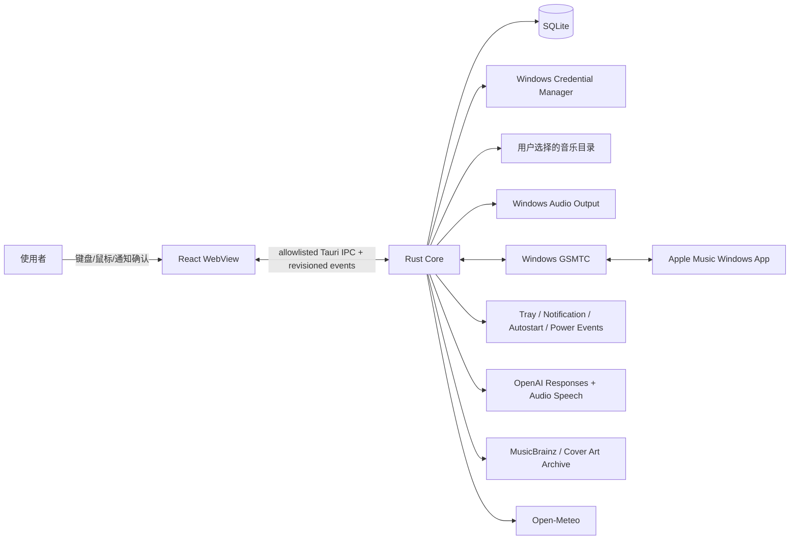
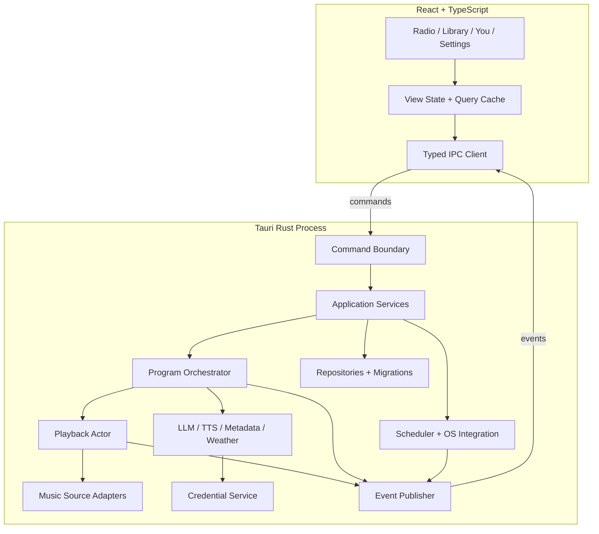
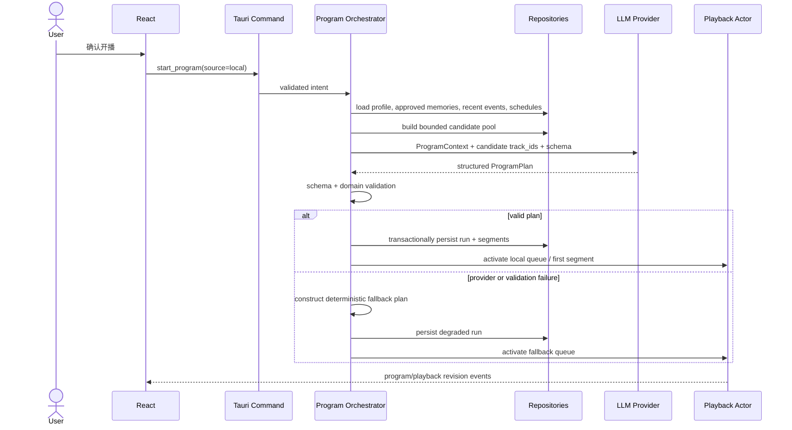

# CyberKindred 系统架构

| Metadata | Value |
|---|---|
| Status | Approved |
| Owner | Core Architecture |
| Last Verified | 2026-09-02 |
| Source of Truth For | 系统边界、组件职责、依赖方向、运行时所有权、信任边界与部署拓扑 |
| Related Documents | [PRD](../product/PRD.md), [FRS](../product/FRS.md), [NFRS](../product/NFRS.md), [Runtime State Machines](RUNTIME-STATE-MACHINES.md), [AI Orchestration](AI-ORCHESTRATION.md), [Data Model](DATA-MODEL.md), [API Contract](../contracts/API-CONTRACT.md), [Provider Contracts](../contracts/PROVIDER-CONTRACTS.md), [ADR-0001](adr/ADR-0001-tauri-react-rust.md) |

## 1. 架构目标与边界

CyberKindred v1 是单用户、Windows 10 22H2/Windows 11 x64、local-first 的桌面应用。应用以 Tauri 2 打包；React + TypeScript + Vite 提供表现层，Rust 提供全部受信能力。v1 不提供外部 HTTP 服务、云端账号系统、跨设备同步、屏幕或麦克风采集，也不自动操控 Apple Music Web DOM。

需求引用使用领域前缀（`FR-ONB`、`FR-LIB`、`FR-RAD`、`FR-APL`、`FR-CHAT`、`FR-MEM`、`FR-SCH`、`FR-WEA`、`FR-SET`、`FR-DAT`）；具体需求编号以 [FRS](../product/FRS.md) 为唯一来源。

## 2. 架构约束

| ID | 约束 |
|---|---|
| ARCH-001 | React/WebView 是不受信表现层，只能调用 [API Contract](../contracts/API-CONTRACT.md) 中列出的 Tauri commands 并订阅列出的 events。它不得直接访问文件、数据库、网络、凭据、音频设备或 Windows API。 |
| ARCH-002 | Rust Core 唯一拥有文件扫描、SQLite、网络请求、Windows Credential Manager、音频播放、GSMTC、调度、通知、自启动和系统生命周期处理。 |
| ARCH-003 | 所有 WebView 输入在 Rust 命令边界完成长度、枚举、标识符、路径作用域和状态前置条件校验；返回稳定、可脱敏的错误，不回传底层 secret 或原始 provider body。 |
| ARCH-004 | 音乐来源通过 `MusicSourceAdapter` 隔离。`LocalMusicSource` 可设置精确队列；`WindowsMediaSessionSource` 仅按 GSMTC 当前会话实时声明的 capability 提供控制。 |
| ARCH-005 | 本地音频使用 `rodio` 输出、`Symphonia` 解码；标签与嵌入封面使用 `lofty`。解码与扫描在非 UI 线程执行，状态变化串行进入 playback actor。 |
| ARCH-006 | SQLite 是非敏感持久状态的唯一数据库。所有写入通过单一 repository 边界和事务完成；schema 只由前向、版本化迁移改变。 |
| ARCH-007 | API Key 只存 Windows Credential Manager；内存中 secret 不实现 `Debug`/序列化，不进入前端状态、SQLite、诊断包或日志。 |
| ARCH-008 | OpenAI、MusicBrainz、Cover Art Archive、Open-Meteo 只能由 Rust provider 调用；每个 provider 必须实现超时、限流、错误分类、脱敏和可替换测试实现。 |
| ARCH-009 | OpenAI Responses 请求使用 JSON Schema Structured Outputs 且 `store: false`；服务端输出必须先过 schema 和领域约束双重校验，才可影响节目或记忆。GSMTC metadata、state、event 和 Apple display snapshot 不得进入 Responses 或 Speech。 |
| ARCH-010 | 模型不能访问任意本地曲库。Rust 先产生带真实 `track_id` 的有限候选集；模型只能排序或选择候选，非法、未知或重复越限的 ID 被拒绝。 |
| ARCH-011 | 记忆采用 proposed → user approval → approved 的显式流程；未经批准的提案不得进入长期上下文。原始对话按 30 天策略清理，摘要与已批准记忆分开存储。 |
| ARCH-012 | 所有长期任务都必须可取消并具有 owner：library scanner、program runner、TTS、provider request、scheduler。窗口关闭不得遗留孤立任务。 |
| ARCH-013 | 本地播放、系统媒体、节目、TTS 打断、日程和睡眠恢复遵循 [Runtime State Machines](RUNTIME-STATE-MACHINES.md)；事件携带单调 revision，陈旧结果不得覆盖新状态。 |
| ARCH-014 | 计划时段只产生 Windows 通知；必须由用户确认后才开始有声播放。托盘、自启动和通知均为用户可关闭设置。 |
| ARCH-015 | 外部服务不可用时优先保持可控的本地播放；LLM 失败使用确定性队列，TTS 失败显示文本，天气/元数据失败省略增强信息。 |
| ARCH-016 | UI 只显示当前权威快照及后续 revision 事件；窗口重载后必须重新拉取快照，不能把前端缓存当作运行时事实。 |
| ARCH-017 | 运行日志采用结构化事件和 request correlation ID，默认不记录对话正文、曲库绝对路径、API Key、provider 原始响应或完整媒体 URL。 |
| ARCH-018 | 发行物是 per-user NSIS 安装包；应用数据、缓存和日志位于系统分配的用户数据目录，安装目录只放只读二进制与资源。 |
| ARCH-019 | 任何新增外部网络目的地、浏览器自动化、系统权限或高风险生产依赖，都属于架构边界变更，须先更新 FRS/NFRS、威胁模型与 ADR 并取得用户批准。 |

## 3. 系统上下文



Apple Music 集成仅经 GSMTC 观察和控制 Apple Music Windows App 暴露的系统媒体会话。它不是 MusicKit、不会读取 Apple Music 账号或资料库，也不承诺指定任意云端曲目。

## 4. 容器与组件



| 组件 | 唯一职责 | 不得承担 |
|---|---|---|
| Typed IPC Client | command DTO、event DTO、revision 丢失后的 snapshot 重取 | 业务规则、secret 或直接网络 |
| Command Boundary | 身份无关的参数验证、状态前置条件、错误映射、correlation ID | SQL、HTTP 或设备控制细节 |
| Application Services | 用例事务与 repository/provider/source 编排 | UI 文案、原始 OS 句柄 |
| Program Orchestrator | local 上下文/候选/节目计划、system-session 本地确定性模板、segment 推进、降级 | 自行解码音频、直接写 SQL 或向 provider 发送 GSMTC 数据 |
| Playback Actor | 单线程化播放意图、队列、position、revision、竞态裁决 | 推荐、记忆判断、UI 控制 |
| Music Source Adapters | 本地音频或系统媒体能力的统一语义 | 伪造未暴露 capability |
| Provider Adapters | 外部协议、超时、限流、缓存键与错误分类 | 直接改变播放/记忆状态 |
| Repositories | 事务、查询、迁移与保留清理 | secret、网络、领域决策 |
| Scheduler/OS Integration | 日程计算、通知、托盘、自启动、power session | 未经用户确认自动开播 |
| Credential Service | Credential Manager 的保存、读取、删除、内存包装 | secret 序列化、向 WebView 返回 secret |

## 5. 依赖方向与进程内并发

依赖方向固定为 `presentation → application → domain ← infrastructure`。领域类型与状态机不依赖 Tauri、React、SQLite、HTTP、rodio 或 Windows API。基础设施实现由 application composition root 注入。

- Tauri 主线程只处理窗口与系统要求的 UI 工作。
- Tokio runtime 负责可取消的网络、调度、数据库协调和事件管道；阻塞扫描、标签读取与可能阻塞的解码初始化进入有界 blocking pool。
- `PlaybackActor` 通过有界 channel 接收意图。每个意图带 `request_id`，每次成功或失败转换递增 `playback_revision`。
- 节目执行器按 `program_run_id` 串行推进 segment；开始新节目会取消旧 run 的 LLM/TTS 工作并使其结果失效。
- 扫描器每个 root 同时最多一个 job；重复扫描命令返回既有 job 状态或显式冲突，而不创建第二个写入者。
- 事件发布使用快照 + 增量模型。UI 检测 revision 不连续时停止应用增量并请求新快照。

## 6. 主要运行流

### 6.1 本地节目启动



### 6.2 Apple Music 串场

```mermaid
sequenceDiagram
    participant G as GSMTC Adapter
    participant A as Playback Actor
    participant P as Program Orchestrator
    participant UI as React
    participant T as TTS Provider
    participant O as Local Audio Output

    G-->>A: track/session changed + capability snapshot
    A-->>P: authoritative now-playing event
    P-->>UI: local deterministic track-aware text
    Note over P,UI: GSMTC metadata stays local; this text is never sent to Responses/Speech
    P->>T: generic voice text with no GSMTC-derived fields
    T-->>P: cached audio artifact or classified failure
    P->>A: request_interruption(expected session/revision)
    A->>G: pause only if CanPause
    G-->>A: paused snapshot
    A->>O: play TTS artifact
    O-->>A: completed
    A->>G: resume only if resume token still valid
    Note over A,G: session switch, manual user action or revision mismatch invalidates resume
```

## 7. 信任边界与数据流

| 边界 | 允许跨越的数据 | 强制控制 |
|---|---|---|
| WebView → Rust | contract DTO、用户选择、文本输入、opaque IDs | command allowlist、长度/枚举/状态检查；WebView 不提供任意 SQL/URL/命令 |
| Rust → WebView | 脱敏 view models、相对/显示路径、capabilities、revision、稳定错误 | serializable allowlist；禁止 secret、provider 原文和 credential handle |
| Rust → OpenAI | local 节目上下文、用户输入、有限 local 候选元数据、最小 summary 输入、无 GSMTC 字段的 TTS 文本 | 用户配置的 key；`store: false`；超时；schema；严格排除 Apple/GSMTC metadata、identity、state、event 和 display snapshot |
| Rust → MusicBrainz/CAA | 曲名、艺术家、专辑、MBID 与封面请求 | 明确 User-Agent、全局 1 request/second、永久匹配缓存、低置信度不覆盖原标签 |
| Rust → Open-Meteo Geocoding | 用户显式提交的城市 search query、language、result count | search query/candidates 只在内存保留 10 分钟；不使用 GPS、IP geolocation 或后台定位，不发送画像/音乐/对话 |
| Rust → Open-Meteo Forecast | 用户已选城市四位小数 latitude/longitude、IANA timezone、current weather 所需变量与单位 | 不发送城市自定义 label、精确实时定位或画像；30 分钟缓存；过期值不进入 AI context，失败时省略天气 |
| Rust ↔ 文件系统 | 仅用户批准的 library roots、app data 与 cache | canonicalize 后做 root containment；禁止 UI 构造任意读取路径 |
| Rust ↔ GSMTC | 会话身份、媒体属性、timeline、playback info、控制意图 | 只绑定明确识别的 Apple Music session；每次按 capability 和 revision 校验 |

## 8. 持久化、缓存与部署

- 数据表、键、索引、保留和迁移以 [Data Model](DATA-MODEL.md) 为唯一来源。
- TTS 音频、封面和 provider 可再生结果位于 cache 目录，LRU/额度清理不得删除用户原音乐。
- 应用设置存 SQLite；API Key 存 Credential Manager。provider model ID、base URL 和非敏感偏好可入库。
- Rust 崩溃恢复时，将未终止 `program_runs`/scan jobs 标为 interrupted，重建 scheduler，重新发现 GSMTC；不自动恢复有声播放。
- NSIS per-user 安装不要求管理员权限。自启动通过 Tauri autostart/Windows user-level mechanism，只有显式设置后启用。

## 9. 架构验证门槛

1. TypeScript 只能引用生成/共享的 IPC DTO，不含文件、HTTP、数据库或 credential 客户端。
2. 架构测试验证 presentation 不依赖 infrastructure，且 secret 类型不可序列化。
3. 每个 provider/source 有 hermetic fake；默认测试不发真实网络请求。
4. 状态机模型测试覆盖非法转换、取消、陈旧 revision 和 TTS resume 竞态。
5. 打包态 Windows 探针验证 Apple Music 会话枚举、元数据、capability 与基本控制；缺失 capability 是受支持状态而非错误。
6. 日志扫描验证 key、Authorization header、对话正文和绝对曲库路径均未出现。

## 10. 外部参考

- [OpenAI Responses：`store` 与 structured text output](https://developers.openai.com/api/reference/cli/resources/responses/methods/create)
- [OpenAI Text to speech](https://developers.openai.com/api/docs/guides/text-to-speech)
- [Windows GlobalSystemMediaTransportControlsSession](https://learn.microsoft.com/en-us/uwp/api/windows.media.control.globalsystemmediatransportcontrolssession)
