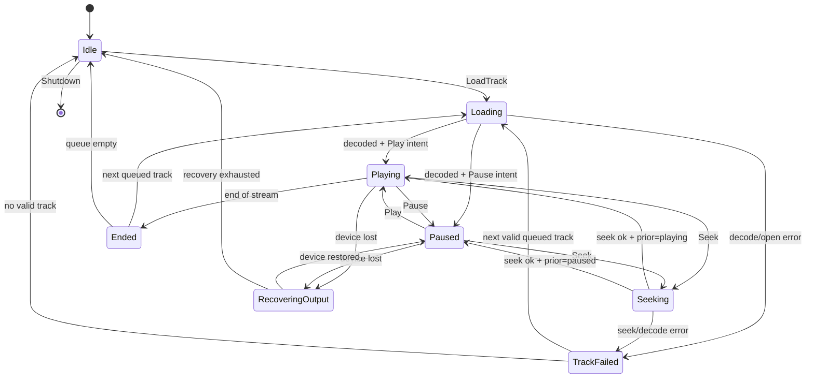
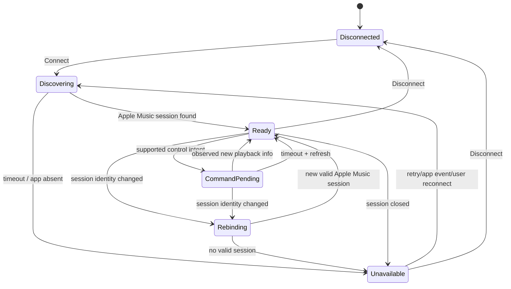
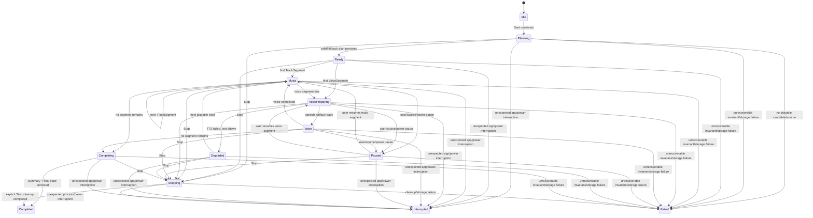
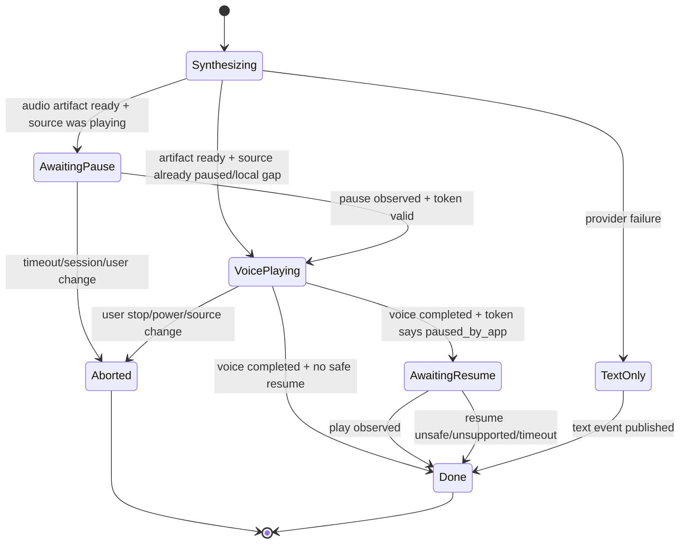
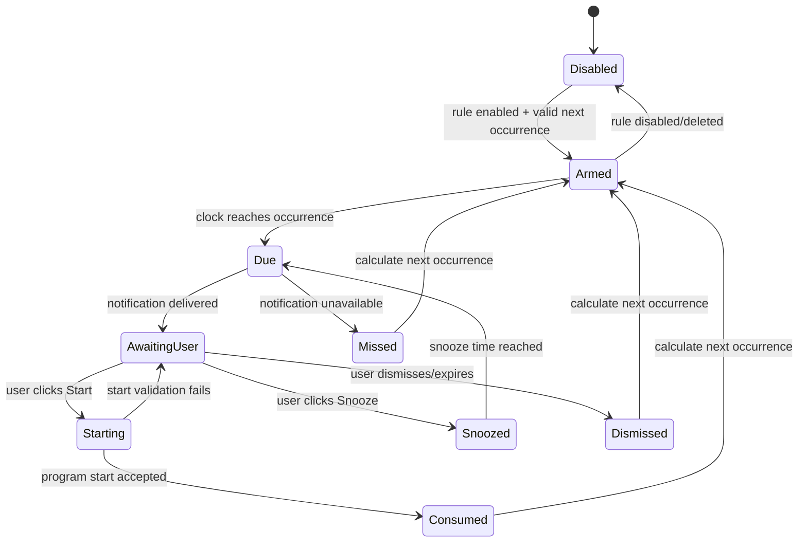
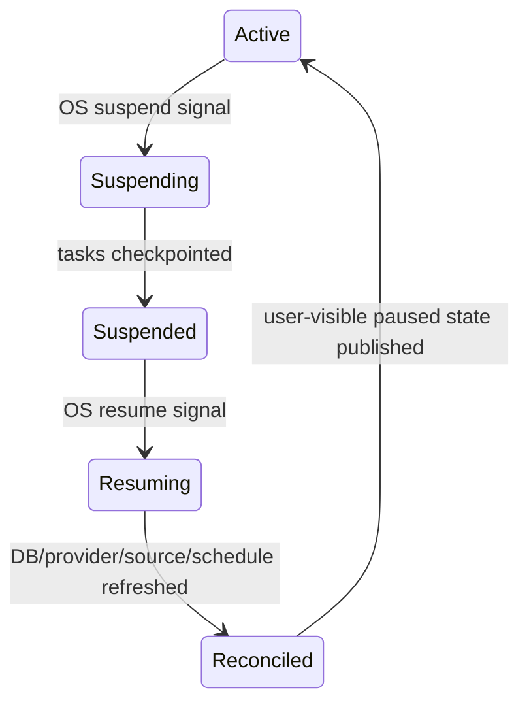

# CyberKindred 运行时状态机

| Metadata | Value |
|---|---|
| Status | Approved |
| Owner | Core Architecture |
| Last Verified | 2026-09-02 |
| Source of Truth For | 本地播放、系统媒体、节目、TTS 打断、日程、睡眠/恢复的状态、转换、竞态与失败语义 |
| Related Documents | [Architecture](ARCHITECTURE.md), [AI Orchestration](AI-ORCHESTRATION.md), [API Contract](../contracts/API-CONTRACT.md), [Provider Contracts](../contracts/PROVIDER-CONTRACTS.md), [Acceptance Tests](../testing/ACCEPTANCE-TESTS.md) |

## 1. 通用规则

1. 所有状态机在 Rust 内运行；React 只能发出意图并观察快照/events，不能自行推进状态。
2. 每个 aggregate 有单调递增的 `revision`。异步结果必须携带创建时的 `run_id`、`operation_id` 与期望 revision；任一不匹配即作为 `stale_result` 丢弃并记录不含敏感内容的诊断事件。
3. 命令受理不等于外部动作已完成。先返回 accepted/operation ID，再由状态事件报告完成或失败；同步 command 的具体语义以 API Contract 为准。
4. 取消是终态转换的一部分。被替代的 provider request、scan、TTS 或 program task 必须先取消，再允许新 owner 获得资源。
5. 每次内部状态转换在同一事务中持久化必要的运行记录；只有 coarse public projection 改变时才写 non-content outbox event。同一 projection 内转换与纯高频 position tick 不写 outbox，position 只保留最近快照。
6. 失败分为 `transient`、`rate_limited`、`auth`、`invalid_input`、`capability_missing`、`not_found`、`conflict`、`permanent`。只有 transient/rate-limited 可按本文件重试。
7. 任何 OS resume、窗口重载、GSMTC 重连或 provider 重试均不得自动产生用户没有确认的新声音。

## 2. 本地播放状态机 `LocalPlayback`



| 当前状态 | 输入/条件 | 动作与下一状态 |
|---|---|---|
| `Idle` | `load(track_id, autoplay)` | 从 repository 解析 canonical path；进入 `Loading`；文件必须仍位于已批准 library root。 |
| `Loading` | 文件打开、Symphonia probe/decode 初始化成功 | 建立 rodio sink；`autoplay=true` → `Playing`，否则 `Paused`；发布 duration/metadata 快照。 |
| `Loading` | 文件缺失、损坏或 codec 不支持 | 记录 `track_unavailable`/`decode_failed`，进入 `TrackFailed`；不修改原文件。 |
| `Playing`/`Paused` | `seek(position_ms)` 且 capability 支持、位置在 `[0,duration]` | 进入 `Seeking`；位置越界在边界层拒绝，不转换。 |
| `Seeking` | 成功 | 回到进入前的 playing/paused 状态；递增 revision。 |
| `Seeking` | 失败 | 当前 track 进入 `TrackFailed`；节目层决定跳过或停止。 |
| `Playing` | 流结束 | `Ended`；有队列时加载下一首，无队列时 `Idle` 并通知 Program。 |
| 任意非终态 | `stop`/program cancelled | 停止 sink、释放 decoder、清空 active queue → `Idle`。 |
| `Playing`/`Paused` | 默认输出设备丢失 | 停止 sink，保留 track/position，进入 `RecoveringOutput`；UI 显示内联恢复状态。 |
| `RecoveringOutput` | 新设备在 10 秒内出现 | 重新打开输出，在保存位置创建 paused sink → `Paused`；只有用户再次 `Play` 才出声。 |
| `RecoveringOutput` | 10 秒超时或 3 次初始化失败 | 进入 `Idle`，返回 `audio_output_unavailable`，Program 进入 `Paused`/`Degraded`。 |

约束：同一时刻只有一个 rodio output owner；queue 更新按完整快照原子替换；`previous` 在当前曲播放超过 5 秒时先 seek 到 0，否则转上一首；音量限制为 `[0,1]` 并保存在设置中，但首次启动默认 0.7。

## 3. Windows 系统媒体状态机 `SystemMediaSession`



`Ready` 是携带数据的状态，不按本地假设细分；其快照包含 `session_id`、`source_app_id`、`media_identity`、`playback_status`、timeline 和实时 capability (`can_play`、`can_pause`、`can_seek`、`can_next`、`can_previous`)。

| 场景 | 决策 |
|---|---|
| 会话选择 | 只接受已知 Apple Music Windows App 标识且由用户在 Settings 明确选择/连接的会话；不把其他活跃播放器静默当作 Apple Music。若同时有多个候选，要求用户选择，不自动猜测。 |
| 命令发出 | 每次重新读取 capability；缺失时以 `capability_missing` 拒绝。进入 `CommandPending`，保存 session/revision/intent token。 |
| 成功确认 | 以 GSMTC 的后续 playback/timeline event 为事实；匹配预期即完成 operation。 |
| 2 秒无确认 | 主动 refresh 一次；仍无可观察变化则 operation 以 `external_control_timeout` 结束，状态回 `Ready`，不假定 Apple Music 已执行或回滚。 |
| 外部用户操作 | GSMTC event 总是权威；更新 snapshot/revision，并使冲突的 pending command/TTS resume token 失效。 |
| 会话切换/关闭 | 进入 `Rebinding`/`Unavailable`，取消 pending operation，清空可恢复 token；Program 保持运行但进入 `Paused`/`Degraded`，等待用户。 |
| 元数据缺失 | 仍保持 `Ready`；以 unknown display fields 表示，不构造虚假曲名。`media_identity` 无法稳定建立时不生成曲目级记忆。 |
| seek | 仅在 `can_seek=true` 且 timeline 范围有效时允许；目标裁剪不是隐式行为，越界由 API 边界拒绝。 |

## 4. 节目状态机 `ProgramRun`



| 状态 | 核心不变量与失败处理 |
|---|---|
| `Idle` | 无 active run、segment owner 或 TTS resume token。 |
| `Planning` | 保存 `program_run_id`。local 模式组装上下文、候选和 structured plan，OpenAI auth/limit/timeout/invalid output 时使用确定性 fallback；Apple Music 模式不调用 Responses，仅装载本地确定性 track-aware text policy 与不含 GSMTC 数据的通用 voice policy。 |
| `Ready` | 计划已通过 schema + domain validation 并事务写入；尚未开始声音。只有用户已确认的 start intent 可以离开此状态。 |
| `Music` | 当前 segment 必须引用存在且可播放的 local track，或当前真实 system-media item。曲目不可用时标记 segment skipped 并推进；所有音乐均失败则 `Paused` 并要求用户处理。 |
| `VoicePreparing` | TTS request 可取消；失败时保留文字串场，进入 `Degraded`，不阻断下一首。system-session 中只有完全不含 GSMTC/Apple metadata、identity、state 或 event 的通用 voice segment 可进入此状态。 |
| `Voice` | TTS artifact 是唯一 local output owner；系统媒体必须持有有效 interruption token。本地节目保存 local track position 并在 token 有效时恢复。track-aware Apple reaction 只显示文字，永不进入此状态。 |
| `Paused` | 不允许自动出声；用户显式 resume 后根据尚未完成的 segment 回到 `Music` 或 `VoicePreparing`。 |
| `Degraded` | 记录具体 degraded feature（LLM/TTS/weather/metadata/system session）；能继续播放则推进，不能继续则 `Paused`。 |
| `Completing` | 原子写入完成时间、统计、对话摘要任务状态；摘要失败不把节目改为失败，可在下次启动重试。 |
| `Stopping` | 取消 provider/TTS、停止本地 sink、放弃 TTS resume；对于 Apple Music 仅在有效 token 表明由通用 TTS 暂停时尝试安全恢复，否则不发命令。用户显式 Stop 清理成功后进入 `Completed`。 |
| `Completed`/`Interrupted`/`Failed` | 终态不可重开；`Interrupted` 只表示非用户请求的异常中止。再次开播创建新 `program_run_id`。 |

### 4.1 Public event coarse projection

Rust 先更新内部状态和 revision，再按下表计算 public projection。只有 projection 值改变时才 emit EVT-002/EVT-003；同一 public projection 内的内部转换不 emit。UI 发现 sequence gap 时仍重新读取权威 snapshot。

| Internal Program state | EVT-002 `state` |
|---|---|
| `Planning`, `Ready` | `planning` |
| `Music`, `VoicePreparing`, `Voice`, `Degraded`, `Completing` | `running` |
| `Paused` | `paused` |
| `Stopping` | `stopping` |
| `Completed` | `completed` |
| `Interrupted`, `Failed` | `failed` |

`Idle` 没有 active `programId`，不产生 EVT-002。显式 Stop 的路径为 `Stopping → Completed`；崩溃、资源被意外取消或不可恢复 source failure 才投影为 `failed`。

| Internal Segment status | EVT-003 `state` |
|---|---|
| `planned`, `preparing` | `queued` |
| `active` | `playing` |
| `completed` | `completed` |
| `skipped`, `cancelled` | `skipped` |
| `failed` | `failed` |

## 5. TTS 打断与恢复状态机 `Interruption`

### 5.1 Resume token

只有不含任何 GSMTC/Apple metadata、identity、state 或 event 的通用 voice segment 可以启动 system-session interruption；track-aware reaction 只显示文字。在暂停任何正在播放的来源前创建不可持久化的 `ResumeToken`：

```text
program_run_id
interruption_id
source_kind
source_instance_id
source_revision_before_pause
media_identity
was_playing
pause_operation_id
paused_by_cyberkindred=false
external_action_generation
created_at_monotonic
```

只有观察到同一 `pause_operation_id` 导致目标来源从 playing 变为 paused，才将 `paused_by_cyberkindred=true`。token 在进程退出、睡眠、session change、media identity change、用户播放控制、stop、超时 2 分钟或任一 revision 不一致时立即失效。



### 5.2 竞态裁决

1. TTS 合成期间若歌曲变化，只有 provenance/taint 检查仍证明文案完全不依赖任何媒体 identity/metadata 的通用 artifact 才可显示或继续；不得为了它打断新歌曲。检测到旧歌相关性视为 policy violation，立即丢弃，且该文案本不应发往 Speech。
2. 请求 pause 后、观察 pause 前用户手动 pause：`external_action_generation` 改变，视为用户动作，token 不获得恢复权；可在来源已静音时播放 TTS，但结束后不 resume。
3. TTS 播放期间用户对 Apple Music 点 play/next/previous/seek，立即使 token 失效并停止 TTS，用户动作获胜。
4. TTS 播放期间系统媒体 session 关闭或换绑，停止 TTS 并进入 `Aborted`；不向新 session 发 play。
5. voice 完成与 user pause 同时到达时，按 actor mailbox 顺序处理；任何在 resume command 前观测到的 external generation 变化阻止 resume。
6. resume command 发出后 2 秒未观察 playing，仅 refresh 并结束 token；不重试 play，避免与用户争夺控制。
7. 本地源也使用相同 token；通过 actor 自己的 command generation 区分应用 pause 与 UI user pause。恢复只回到保存 position，解码失败则节目转 `Paused`。

## 6. 日程状态机 `ScheduleOccurrence`



- scheduler 使用保存的 IANA timezone 和 local wall-clock rule 计算下次 occurrence；夏令时不存在的本地时间向前移到第一个有效分钟，重复时间只触发一次，并保存 occurrence UTC key 去重。
- OS/应用关闭导致错过时：恢复后 15 分钟内只补发一次“错过的节目”通知；超过 15 分钟标为 `Missed`。无论何种情况都不自动播放。
- `Snooze` 只接受 10、30、60 分钟；同一 occurrence 始终只有一个有效 snooze，用户改选时原子替换原时间，不修改重复 Schedule Rule。
- 通知失败写入可见错误，但 scheduler 继续计算后续 occurrence。通知权限关闭时 Settings 显示修复指引。
- 同一个 occurrence 的 Start action 以 occurrence ID 幂等；重复点击返回同一 start operation。

## 7. 睡眠/恢复状态机 `PowerLifecycle`



| 阶段 | 必须完成的动作 |
|---|---|
| `Suspending` | 使全部 TTS resume token 失效；暂停并 checkpoint 本地 track/position；取消网络请求；flush SQLite；保存 scheduler last-check UTC。等待上限 2 秒，超时仍允许 OS suspend。不得为了串场控制 Apple Music。 |
| `Suspended` | 不运行 interval timer，不推断播放进度。 |
| `Resuming` | 重新打开/health-check SQLite，检测系统时钟跳变，重新枚举输出设备和 Apple Music session，刷新 schedule occurrence；provider 不主动联网，直到用例需要。 |
| `Reconciled` | 本地节目保持 `Paused` 并显示“电脑已恢复，是否继续”；Apple Music 采用新 GSMTC snapshot，但不发送 play/pause；处理中断的 run 标记可恢复或 interrupted。 |
| 恢复失败 | DB 不可用进入只读恢复界面；音频不可用保持 paused；GSMTC 不可用显示 disconnected；scheduler 仍尝试在内存中计算但不触发声音。 |

## 8. 重启恢复与故障矩阵

| 故障 | 状态转换 | 自动重试 | 用户可见结果 |
|---|---|---|---|
| OpenAI timeout/5xx | `Planning → Ready` 并记录 LLM degraded、使用 fallback；`VoicePreparing → Degraded` | 原 deadline 内最多 2 次 exponential backoff + full jitter；仅幂等请求 | 本地确定性计划或文字串场 |
| OpenAI auth | `Planning → Ready` 并记录 LLM degraded；`VoicePreparing → Degraded` | 不重试 | Settings 显示重新验证 Key；音乐可继续 |
| MusicBrainz/CAA/Open-Meteo limit/timeout | provider degraded，Program 不停止 | MusicBrainz/CAA 原 deadline 内最多 2 次且受 1 req/s/Retry-After；weather search 不重试，forecast 10 秒总 deadline 内最多 1 次重试 | 使用未过期缓存或省略增强内容 |
| SQLite busy | 当前事务不转换业务状态 | 50/100/200ms 共 3 次 | 仍失败则稳定 `storage_busy`，不丢写入 |
| SQLite migration/corruption | app boot → recovery mode | 不自动破坏性修复 | 提供备份/恢复/重置路径，不启动节目 |
| 本地文件消失 | track → `TrackFailed` | 不重试同文件 | 跳至下一可播放曲；Library 标 unavailable |
| 输出设备消失 | playback → `RecoveringOutput` | 10 秒内最多 3 次 | 恢复后保持 paused |
| Apple Music session 消失 | system media → `Unavailable`；Program → `Paused/Degraded` | 监听 session event；30 秒低频发现 | 显示连接步骤，不绑定其他播放器 |
| 进程异常退出 | active run 在下次启动标 `Interrupted` | 无自动播放 | 可选择从下一首重开新 run |

应用启动时只恢复非发声基础设施：迁移数据库、清理过期原文、重建 scheduler、发现设备/媒体会话并发布快照。任何上次为 playing 的节目都以 paused/interrupted 呈现，等待用户确认。

## 9. 内部错误到公共错误的唯一映射

内部状态/原因字符串只用于 Rust 分支与脱敏诊断，绝不直接跨 IPC。Command/Event 边界固定映射如下；未列出的内部错误一律映射 `ERR-1601`，不得临时创造新的 public code。

| Internal condition/code | Public `ERR-*` |
|---|---|
| 参数、枚举、position 或 schema 无效；`invalid_input` | `ERR-1001` |
| stale revision/idempotency ownership；`conflict` | `ERR-1003` |
| entity/track/schedule/operation 不存在；`not_found` | `ERR-1004` |
| SQLite busy 在 50/100/200ms 重试后仍未取得锁；`storage_busy` | `ERR-1005` |
| operation 被用户取消；`cancelled` | `ERR-1006` |
| source capability 缺失；`capability_missing` | `ERR-1201` |
| source/app/output 不可用、GSMTC action 2 秒未确认；`audio_output_unavailable`, `external_control_timeout` | `ERR-1202` |
| GSMTC session/revision/media identity 漂移 | `ERR-1203` |
| local 文件 missing/corrupt/unsupported 或 decode/seek 失败；`track_unavailable`, `decode_failed` | `ERR-1204` |
| provider auth/rate-limit/timeout/unavailable/invalid response | 分别 `ERR-1301` 至 `ERR-1305` |
| SQLite I/O/transaction 永久失败 | `ERR-1401` |
| migration/integrity/corruption 导致 recovery mode | `ERR-1402` |
| path 越界/权限拒绝 | `ERR-1501` |
| 未分类 invariant/actor failure | `ERR-1601` |
