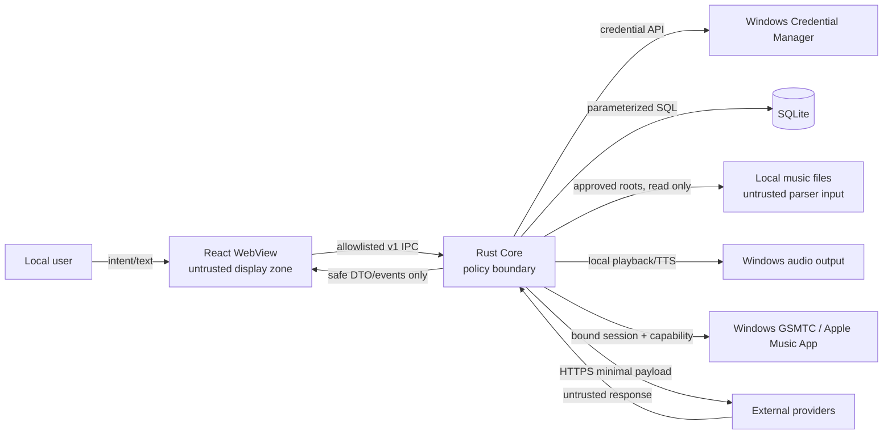

# CyberKindred Threat Model

| Field | Value |
|---|---|
| Status | Draft |
| Owner | Security Steward |
| Last Verified | 2026-09-01 |
| Source of Truth For | MVP 的资产、攻击者、信任边界、安全目标、攻击面、缓解与严重度校准 |
| Related Documents | `SECURITY.md`, `docs/architecture/ARCHITECTURE.md`, `docs/architecture/DATA-MODEL.md`, `docs/contracts/API-CONTRACT.md`, `docs/security/PRIVACY-DATA-LIFECYCLE.md` |

## 1. Overview

CyberKindred 是 Windows 10 22H2/Windows 11 上的单用户桌面 AI 陪伴电台。正常数据流是：React WebView 收集显式用户意图，经 allowlisted Tauri IPC 进入 Rust Core；Rust Core 访问用户选择的只读音乐目录、SQLite/cache、Windows Credential Manager、Windows GSMTC 与明确配置的 HTTPS provider；本地音频引擎播放用户文件和 TTS。MVP 不监听端口、不提供外部 HTTP API、不读取屏幕/麦克风，也不自动播放日程通知。

当前仓库处于 Documentation Baseline，尚无产品实现。以下控制是已批准的设计要求，不是经过代码审计证明已生效的控制；每个实现任务必须用契约、集成、隐私和真实设备测试把对应假设转为证据。本威胁模型由当前负责代理顺序审阅，未进行第二个 fresh-context 独立架构审阅；实现安全门应补充独立复核。

### 1.1 Components and sources

| Component | Responsibility and privilege | Design evidence |
|---|---|---|
| React WebView | 展示 UI、收集用户输入；无 secret、数据库、任意文件或 provider 直接访问权 | [API Contract](../contracts/API-CONTRACT.md) |
| Tauri IPC boundary | command allowlist、request schema、revision/idempotency、safe error/event serialization | [API Contract](../contracts/API-CONTRACT.md) |
| Rust Core | 唯一的授权与 side-effect coordinator；provider/source capability、路径、保留和删除执行者 | [Architecture](../architecture/ARCHITECTURE.md), [Provider Contracts](../contracts/PROVIDER-CONTRACTS.md) |
| Local media scanner/player | 解析不可信音频/tag/artwork，维护只读索引并播放 | [Data Model](../architecture/DATA-MODEL.md) |
| SQLite/cache/logs/outbox | profile、历史、对话、memory、schedule 与可再生缓存；不得含 secret；outbox 只含 coarse ID/state/counter，不含正文、路径或 GSMTC metadata | [Data Model](../architecture/DATA-MODEL.md), [Privacy Lifecycle](PRIVACY-DATA-LIFECYCLE.md) |
| Windows Credential Manager | 保存按 origin 隔离的 OpenAI-compatible API Key | [Privacy Lifecycle](PRIVACY-DATA-LIFECYCLE.md) |
| GSMTC adapter | 绑定一个用户选择的系统媒体会话并按 runtime capability 控制 | [Provider Contracts](../contracts/PROVIDER-CONTRACTS.md), [External Integrations](../integrations/EXTERNAL-INTEGRATIONS.md) |
| Network providers | OpenAI Responses/Speech、MusicBrainz、CAA、Open-Meteo；只接收最小 allowlisted 数据 | [External Integrations](../integrations/EXTERNAL-INTEGRATIONS.md) |
| Build/release toolchain | 解析依赖、打包 Rust/JS/native binary/font/notice，生成 NSIS 制品 | [Legal and Licensing](LEGAL-AND-LICENSING.md) |

### 1.2 Effective resources

| Deployment or workflow | Resource or capability | Configuration and precedence | Safe effective value or location | Readers, writers, or recipients | Enforcing control | Evidence or unknowns |
|---|---|---|---|---|---|---|
| Per-user desktop | OpenAI-compatible API Key | User-confirmed origin; credential namespaced by canonical origin | Credential target under `CyberKindred/provider/…`; literal never persisted elsewhere | Rust provider client only; selected HTTPS origin receives Authorization | Credential Manager ACL, no IPC getter, per-origin delete；reset enumerates all CyberKindred origins；log/export canaries | Design: [Privacy](PRIVACY-DATA-LIFECYCLE.md); implementation not yet verified |
| Normal runtime | SQLite | Tauri app data resolver; install/music paths never used | Per-user app data `cyberkindred.sqlite3` | Rust storage layer | application ID, migrations, parameterized access, one writer | Design: [Data Model](../architecture/DATA-MODEL.md) |
| Normal runtime | TTS/cover/staging cache | Tauri cache resolver; Rust generates child paths | Per-user app cache, content-addressed files | Rust cache/audio/image decoders | size/MIME/pixel/hash checks, atomic promotion, expiry | Design only; parser choices need implementation review |
| Diagnostics | Logs | Tauri log resolver; 14 days/50 MiB | Per-user app log directory | Rust logger; user may manually share | structured allowlist + redaction; no body/path/secret | Design: [Privacy](PRIVACY-DATA-LIFECYCLE.md) |
| Reliable local delivery | Operation outbox | Rust repository only；no generic payload serialization | SQLite rows containing kind/opaque IDs/sequence/attempt/status/time/count only | Rust dispatcher；WebView receives allowlisted event DTO | typed per-event projection, no body/path/secret/GSMTC metadata, 24 h/7 d expiry | Design: [Privacy](PRIVACY-DATA-LIFECYCLE.md); implementation canary pending |
| Library import | Music roots | Native picker grants root IDs; WebView never supplies path | Canonical selected root + validated relative child | Scanner/player read; index stores path locally | canonical containment, reparse/symlink checks, no delete/write API | File-system race behavior needs Windows implementation evidence |
| LLM/TTS | Provider origin | Official default or advanced user-confirmed HTTPS origin | Parsed origin with no userinfo/fragment/IP literal; no cross-origin redirect | Receives key plus disclosed local-source context/TTS；never GSMTC/Apple data | origin confirmation, per-origin key, host allowlist, input provenance/taint gate at request time | Custom origin is intentionally a data recipient, not trusted content |
| Metadata | MusicBrainz | Fixed endpoint | `https://musicbrainz.org/ws/2/` | Receives text tags/IP/User-Agent | exact host, GET only, 1 req/s, bounded response | Design: [External Integrations](../integrations/EXTERNAL-INTEGRATIONS.md) |
| Artwork | Cover Art Archive | Validated release MBID only | CAA endpoint; HTTPS redirects only to CAA/Internet Archive host set | Receives MBID/IP | redirect IP/host validation, size/MIME/pixel limits | CDN host evolution may require reviewed allowlist change |
| City search | Open-Meteo Geocoding | Direct user search only; candidate expires in 10 minutes | `https://geocoding-api.open-meteo.com/v1/search` | Receives query/language/count/IP | exact host/parameter allowlist, 2..100 query, no background call | Result is GeoNames-backed; no GPS/IP geolocation |
| Weather | Open-Meteo Forecast | Explicitly selected candidate | `https://api.open-meteo.com/v1/forecast` | Receives rounded coordinates/timezone/IP | exact host/parameter allowlist, 30-minute cache | Forecast does not receive search query/city label |
| Apple companion mode | GSMTC session | User selection binds `SourceAppUserModelId` + session identity | One current system media session | Rust reads metadata/capabilities and sends enabled controls；track-aware reaction is local deterministic visible text | revision/identity recheck; user override aborts resume；no data edge to Responses/Speech | Actual Apple Music capability varies by installed version |
| Release | Dependency/native/font set | Lockfiles + admission policy override transitive defaults | Hash-pinned build inputs and generated SBOM/notices | Build host and final installer | deny/unknown license/advisory/checksum gates | Reproducibility and signing evidence absent until release task |

## 2. Threat model, trust boundaries, and assumptions

### 2.1 Protected assets

- OpenAI-compatible API Keys and future credentials.
- Private conversation text, summaries, profile, location, approved/proposed memories, listening history and feedback.
- Absolute music paths, file metadata, local audio content and the guarantee that source music is never modified/deleted.
- Integrity of program plans, selected `trackId`, memory approval, schedule notification-only behavior and playback capability/state revision.
- Integrity/availability of SQLite, migrations, exports, backups, caches and release artifacts.
- User control of current audio output and the selected GSMTC session; no surprise audio or commands to another session.
- Spend and network destination boundaries: no hidden provider calls, unbounded retry or credential forwarding.

### 2.2 Security objectives

1. Secret values remain in Credential Manager/Rust and never cross WebView, SQLite, logs, event, error, export or crash-report boundaries；per-origin deletion is exact and reset removes credentials for every CyberKindred origin.
2. Every side effect originates from an allowlisted command plus valid, current user intent; provider/model output has no direct authority.
3. User text, music tags/artwork/audio and provider responses stay untrusted data and cannot alter instructions, call tools, approve memory, select arbitrary paths or bypass source capabilities.
4. File operations stay inside an explicitly selected root after canonicalization at time of use; scanner/player never write or delete source music.
5. Deserialization, audio/tag/image parsing and LLM structured output are bounded by type, size, time, memory and concurrency limits.
6. SQLite changes are transactional, migration-verified and recoverable; retention/deletion/export rules are enforced in Rust and covered by frozen-clock/canary tests.
7. GSMTC actions target only the bound identity and current revision；GSMTC/Apple metadata, event, timeline, capability and identity never enter Responses or Speech；track-aware reactions remain local visible text，generic data-free TTS auto-resume yields to user or session changes.
8. Network requests use disclosed HTTPS recipients, minimal fields, bounded redirects/retries and no localhost/private-network pivot.
9. Release inputs are pinned, licensed, scanned and attributable; no unreviewed binary, codec, font or build plugin enters the installer.

### 2.3 Actors and starting capabilities

| Actor | Realistic starting capability | Not assumed |
|---|---|---|
| Local user/operator | Controls app settings, selected files, custom provider origin and explicit destructive confirmations | Not malicious against their own data; their intent still must be bound to exact operation |
| Malicious media author | Controls bytes, container structures, embedded tags/artwork and filenames in a file the user imports | No existing code execution or write access to app data |
| Malicious text/source author | Controls song tags, provider metadata, user-pasted text or prior model output | No authority to become system instruction, invoke IPC or approve memory |
| Network attacker | Can disrupt DNS/network and observe endpoints; may control a non-TLS path or a user-selected malicious compatible origin | Cannot break correctly validated TLS or read Credential Manager by assumption |
| Compromised/buggy provider | Controls HTTP status, headers, JSON, audio/image bytes and model output; receives disclosed payload | No filesystem/IPC/GSMTC authority unless validation is bypassed |
| Other same-user process | May send media keys, change GSMTC session, race files, and read locations allowed by Windows account ACLs | No administrator/SYSTEM privilege; same-user confidentiality from a fully compromised account is not promised |
| Supply-chain attacker | May compromise a dependency release, package registry, build plugin or downloadable binary | No pre-existing control of the trusted release signing environment |
| Remote web attacker | Can influence content only if the WebView loads remote content or an XSS path exists | MVP has no remote listener/public API and should not load arbitrary remote pages in app origin |

### 2.4 Trust boundaries

- **WebView → Rust IPC:** transfers user intent, opaque IDs and bounded text. Rust owns authorization, validation, revisions and side effects; TypeScript validation is convenience only.
- **Rust → local files/parsers:** transfers untrusted bytes into native/Rust parsers. Root selection grants read, not write/delete or access outside containment.
- **Rust → SQLite/cache/log/outbox:** transfers sensitive state to per-user storage. Secret and forbidden fields are structurally excluded；outbox is a typed coarse projection and never a generic serialized body queue；Windows same-user ACL is a deployment assumption, not an app sandbox.
- **Rust → Credential Manager:** transfers secret values. Only provider client may retrieve them; no generic “get secret” command exists.
- **Rust ↔ provider:** sends minimal disclosed local-source data and accepts entirely untrusted responses. TLS authenticates origin, not response correctness or model obedience. There is no allowed GSMTC→provider flow.
- **Rust ↔ GSMTC/source app:** transfers current metadata/capabilities and control authority within the local process. Session identity/revision is part of authorization；track-aware text is local deterministic output and only GSMTC-free generic text may reach TTS.
- **Source/build → installer:** code, transitive dependencies, native binaries, fonts and notices cross into a privileged distributable artifact.

### 2.5 Assumptions and exclusions

- One Windows account owns one local profile. Multi-user/tenant isolation, remote administration and shared-machine encrypted database are outside MVP.
- A process already running with the same user or administrator authority may access user-readable app data; CyberKindred minimizes exposure but does not claim protection from full account compromise.
- Windows, WebView2, Credential Manager, TLS root store, Apple Music app and audio drivers are trusted platform dependencies within supported versions.
- No product telemetry, automatic crash upload, remote update or localhost service exists. Adding any of them changes trust boundaries and requires this document revision before implementation.
- MusicKit, Apple catalog control, browser DOM automation, microphone, screen/activity sensing and server-side CyberKindred accounts are excluded.
- Scenarios below are design-time hypotheses, not validated vulnerabilities or accepted risks.

## 3. Attack surface, mitigations, and attacker stories

| Priority | Scenario and capability gain | Prerequisites | Impact | Existing/planned controls | Required mitigation and verification | Evidence |
|---|---|---|---|---|---|---|
| Critical hypothesis | Compromised build dependency/plugin/native codec executes during build or ships malicious code, gaining all runtime user authority and secrets | Registry/upstream/build host compromise plus missing pin/verification | Secret theft, arbitrary file access, installer compromise across users | Lockfiles, admission policy, SBOM/notices planned | Hash/pin all binary inputs; minimal build credentials; advisory/license/provenance gates; reproducible artifact comparison and isolated signing | [Legal §9](LEGAL-AND-LICENSING.md) |
| High hypothesis | Secret leaks through generic IPC getter, frontend state, debug log, error body, export, crash payload, URL or cross-origin redirect | Implementation exposes key or logs request | API account compromise and spend/data disclosure | No secret getter; Credential Manager; safe error; per-origin keys; no cross-origin redirect | Canary secret tests across DB/log/event/export/crash; redact headers before formatting; deny redirect before Authorization resend | [API Contract](../contracts/API-CONTRACT.md), [Privacy](PRIVACY-DATA-LIFECYCLE.md) |
| High hypothesis | Malicious tag/user text/provider result injects instructions that make the model select paths, arbitrary track IDs, approve memory or produce an executable action | Untrusted data concatenated into instruction channel or model output trusted directly | Privacy loss, persistent manipulation, unauthorized playback/action | Fixed prompt roles; no hosted tools; candidate IDs only; schema + allowlist; memory remains proposed | Structured separation; validate track IDs against candidate set; content policy; memory approval state machine; adversarial tag/prompt corpus | [Provider Contracts §3](../contracts/PROVIDER-CONTRACTS.md) |
| High hypothesis | Crafted audio/container/tag/artwork exploits parser or causes memory/CPU/disk exhaustion | User imports attacker-controlled file; vulnerable/unbounded parser | Code execution at user privilege or app denial of service | Rust boundary, format allowlist and cache limits planned | Prefer memory-safe maintained parsers; per-file size/time/decode limits; bounded scan workers; fuzz container/tag/image parsers; skip quarantine-by-ID without copying source | [Provider Contracts §5](../contracts/PROVIDER-CONTRACTS.md) |
| High hypothesis | Path traversal, alternate data stream, junction/symlink/reparse race or case-fold bug escapes approved root; cleanup targets music/broad directory | Malicious path tree or path changes between scan/use | Read of unrelated files or destructive data loss | Native picker, opaque root IDs, relative path containment, no source write/delete API | Open handles with safe Windows semantics; canonicalize root/target at time of use; verify volume/file identity; reject reparse escape; destructive targets generated under app dirs and resolved before action | [Data Model](../architecture/DATA-MODEL.md) |
| High hypothesis | XSS/remote content in WebView invokes powerful Tauri commands or forges confirmation | Remote/unsanitized HTML reaches app origin and CSP/command scope is weak | All Rust-exposed user authority, including data deletion/provider calls | Local bundled UI; command allowlist; exact delete phrase; no path/secret commands | Strict CSP/no remote scripts, sanitize rendered model text, Tauri capability scopes, request schema/revision, destructive native confirmation and IPC abuse tests | [API Contract §3](../contracts/API-CONTRACT.md) |
| High hypothesis | SQLite injection, malicious JSON, corrupted DB or faulty migration bypasses status/retention constraints or loses data | Unparameterized SQL, unchecked migration, disk corruption | Private data disclosure, persistent policy bypass, data loss | Parameterized typed repository, CHECK/FK, migration checksum, backup/integrity recovery design | Never interpolate user/provider strings; validate JSON on read/write; transaction + copy/verify/swap; corrupt/future DB fixtures; fail closed before scheduler/program | [Data Model §§3–9](../architecture/DATA-MODEL.md) |
| High hypothesis | CAA redirect or malicious image pivots to localhost/private network, leaks request context, or triggers image bomb | Compromised response/redirect; weak URL or decoder checks | SSRF/local probing, resource exhaustion, parser compromise | Fixed MBID route; HTTPS host/IP allowlist; 3 redirects; byte/pixel/MIME caps | Resolve every redirect and block private/link-local/loopback; no auth headers; stream cap before decode; adversarial image tests/fuzzing | [External Integrations §5](../integrations/EXTERNAL-INTEGRATIONS.md) |
| Medium hypothesis | GSMTC session identity changes between pause/TTS/resume; app controls another player or overrides user's manual pause | Multiple sessions, app restart, media key/user action or session replacement | Surprise audio, control of unintended session, degraded trust | Explicit selection, identity + revision checks, runtime capabilities, user override abort | Re-read before/after every action; generation token for coordinator changes; never fallback by title; real-device race matrix including sleep/resume | [Provider Contracts §2](../contracts/PROVIDER-CONTRACTS.md) |
| High hypothesis | GSMTC metadata/event is accidentally merged into prompt, summary or speech text and disclosed to the configured provider | Shared generic context/event serializer or missing provenance boundary | Listening activity disclosure and violation of local-only Apple promise | Separate system-session/local-source DTOs；track-aware reaction local deterministic only；Speech provenance enum | Capture every Responses/Speech request with GSMTC canaries；deny request before network when taint is present；assert summary and outbox exclude Apple fields | [Provider Contracts §§3–4](../contracts/PROVIDER-CONTRACTS.md), [Privacy §4](PRIVACY-DATA-LIFECYCLE.md) |
| Medium hypothesis | Malicious/buggy provider returns oversized JSON/audio, invalid numbers, deceptive text or delayed response after cancel | Provider compromise/network fault | Memory/disk exhaustion, stale state persistence, harmful content | Deadlines, response caps, schema validation, cancellation and safe fallback | Stream with hard cap; finite-number checks; discard late output; content safety rules; one LLM repair only; no raw body logging | [Provider Contracts](../contracts/PROVIDER-CONTRACTS.md) |
| Medium hypothesis | Custom compatible origin tricks user or is later changed, receiving API Key and private context | User enables advanced origin and ignores unclear disclosure | Credential and conversation disclosure to third party | Hostname/data warning, per-origin key, HTTPS/no IP literal, no cross-origin redirect | Require fresh confirmation on origin change; clear old-origin active binding; show recipient in provider status and export no credential | [External Integrations §2](../integrations/EXTERNAL-INTEGRATIONS.md) |
| Medium hypothesis | Retention cleanup, migration backup or export leaves recoverable chat/path copies beyond policy | Cleanup failure, temp-file crash, overbroad export, backup restoration | Long-lived privacy leakage | Fixed expiry, staging cleanup, export allowlist, no secret in DB; delete operation includes backups | Frozen-clock boundary tests; atomic temp lifecycle; scan active DB/backup/export canaries; never report deletion success while a covered copy remains | [Privacy §§5–8](PRIVACY-DATA-LIFECYCLE.md) |
| Medium hypothesis | A generic outbox serializes chat/model/voice正文、path、secret 或 GSMTC metadata and extends retention or replays stale side effects | Reusing public event body as durable payload；missing per-kind schema/expiry | Private data duplication, post-cancel side effect, deletion bypass | Outbox allowlists kind/opaque IDs/status/counters only；delivered 24 h、undelivered 7 d；entity deletion cascades | Schema-level forbidden-field tests；canary scans；cancel/delete/reset races；reconstruct visible state by read API rather than payload正文 | [Privacy §§2,5](PRIVACY-DATA-LIFECYCLE.md) |
| Medium hypothesis | Scheduler or notification action starts sound without current user confirmation, including after resume/DST duplicate | Faulty occurrence dedupe or forged action | Surprise audio/privacy/social harm | `notificationOnly:true` schema; explicit `start` action; occurrence key/state machine | OS action must map to live occurrence and user gesture; DST/resume tests; never treat app launch as consent | [Schedule schema](../contracts/schemas/schedule-rule.schema.json) |
| Medium hypothesis | Logs record raw conversation, paths, provider body or secret through `Debug`/panic/backtrace | Developer instrumentation or error formatting | Local privacy breach and accidental support disclosure | Structured safe fields, 14-day/50 MiB, no upload | Compile-time wrapper denylist; never derive Debug for secret wrappers; panic hook redaction; canary log scan in CI | [Privacy data inventory](PRIVACY-DATA-LIFECYCLE.md) |
| Low hypothesis | MusicBrainz/Open-Meteo request cadence or city query reveals approximate listening/location interest or exceeds external limits | Features enabled and normal network observation | Metadata/privacy leakage, provider block | Explicit search gesture, minimal fields, 10-minute in-memory candidates, one req/s MusicBrainz, 30-min forecast | Allow provider disable, randomize non-urgent metadata work, never background geocode, document third-party logs | [External Integrations §§4,6](../integrations/EXTERNAL-INTEGRATIONS.md) |

## 4. Severity calibration

Severity reflects new capability gained, reachable deployment, affected asset and existing effective controls. Missing implementation evidence lowers confidence, not potential impact.

| Severity | CyberKindred example | Prerequisites that change rating | Counterexample / normally lower rating |
|---|---|---|---|
| Critical | Signed installer or widely used production dependency is compromised and executes arbitrary code for every installed user; or unauthenticated remote code execution exists in an actually exposed update/public interface | Requires a distributed artifact/many users or an exposed privileged interface; MVP has no remote service/update, so those remote variants are unsupported today | A malicious local music file crashing only the importing user's app is not Critical without code execution or broad distribution |
| High | Imported media or WebView injection gains user-level code execution; API Key exfiltration; containment bug deletes source music or reads unrelated private files; migration silently destroys the only active DB | Parser/XSS/path must be reachable with attacker-controlled input and bypass Rust checks; recoverable backup can reduce availability impact but not confidentiality/code execution | The user deliberately configuring a third-party origin after clear disclosure is authorized data sharing, not a vulnerability by itself |
| Medium | GSMTC race controls the wrong same-user session; raw conversation appears in local logs/export; provider redirect reaches local services without credential; unbounded provider output causes persistent app failure | Becomes High if it yields code execution, credentials, broad file access or irreversible loss; becomes Low if strict same-user effect is transient and recoverable | A source capability being false and UI hiding the button is expected degradation, not a security issue |
| Low | Precise error/timing exposes minor local state, metadata call cadence leaks limited activity, or a malformed file causes a bounded single-track skip | Requires observable information or nuisance beyond normal disclosed operation | MusicBrainz receiving the explicitly disclosed title/artist fields, or Windows seeing a user-requested media action, is intended behavior |

Unsupported stories include remote exploitation of a nonexistent localhost API, MusicKit token theft when MVP stores no Apple token, cross-tenant access in a single-user app, and protection against an attacker already controlling the Windows account as administrator. Adding an HTTP service, automatic updater, cloud account, MusicKit, microphone/screen access or multi-user storage invalidates these exclusions and requires threat-model revision before code changes.
